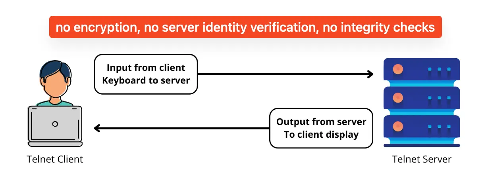
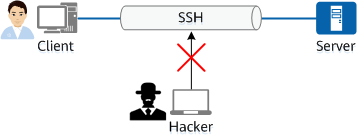

# Introduction to SSH


## Shell, Telnet and SSH

### What is a Shell

A shell is a command-line interface that allows users to interact with an operating system. It interprets user commands and acts as an intermediary between the user and the OS kernel.

<details>
  <summary>Shells on Windows, Linux and macOS</summary>
  <br>
  <ul>
    <li>Shells provide features like command execution, scripting, file manipulation, and process management.</li>
    <li>Windows provides the <b>cmd</b> shell and the <b>Power Shell</b>; <b>bash</b> is becoming available as well.</li>
    <li>Common shells on Linux and MacOS are <b>bash</b> and <b>zsh</b>.</li>
  </ul>
</details>

> [!TIP]  
>
> Use `echo $SHELL` command on Linux and macOS to find out the shell you are using.

### What is Telent

**Telnet** (short for "teletype network")  is a network protocol that allows a user to remotely access and control another computer over the Internet or local area network (LAN). It enables a user to establish a connection to a remote system and perform tasks as if they were sitting in front of that computer.

 

Credit: www.cloudns.net

<details>
  <summary>More details about Telent</summary>
  <br>
  <ul>
    <li>It uses the Transmission Control Protocol (TCP) as its underlying transport protocol.</li>
    <li>It is platform-independent, which means that it can be used to connect to a variety of different operating systems and computers.</li>
    <li>Security concerns: no encryption, no server identity verification, no integrity checks</li>
  </ul>
</details>

### What is SSH

Excerpt from https://www.digitalocean.com/community/tutorials/ssh-essentials-working-with-ssh-servers-clients-and-keys

> The most common way of connecting to a remote Linux server is through SSH. SSH stands for Secure Shell and provides a safe and secure way of executing commands, making changes, and configuring services remotely. When you connect through SSH, you log in using an account that exists on the remote server.

 

<details>
  <summary>Key differences from Telnet</summary>
  <br>
  <ul>
    <li>Encryption: SSH encrypts all data, including login credentials, while Telnet transmits data in plain text.</li>
    <li>Authentication: SSH uses public-key cryptography for stronger authentication.</li>
    <li>Integrity: SSH ensures data integrity, detecting any tampering during transmission.</li>
    <li>SSH Host Key is a cryptographic key used for authenticating computers.</li>
  </ul>
</details>


## SSH and TCP/IP

- IP operates at OSI Model Layer 3. It indicates which IP address should go to.
- TCP is a transport layer protocol, which operates at OSI Model Layer 4. TCP indicates which port a packet should go to at each IP address.
- SSH operates at OSI Model Layer 7. It runs on top of TCP/IP, ensuring reliability and order.
- Default SSH port number is 22

> [!NOTE]
>
> The Network Configuration Protocol (NETCONF) is a network management protocol developed and standardized by the IETF. Default NETCONF Service over SSH port is 830.


## How SSH Works

### SSH Components

- OpenSSH is a freely available version of the Secure Shell (SSH) protocol family of tools. `ssh` command of OpenSSH is a connectivity tool for remote sign-in that uses the SSH protocol.
- The OpenSSH server component, `sshd`, listens continuously for client connections from any of the client tools.

### Authentication Methods

- **Password Authentication:** Simplest but less secure.
- **Public Key Authentication:** Stronger security, using a pair of keys (private and public).
- **Kerberos Tickets**: Single Sign-On capabilities, centralized authentication, mutual authentication, Time-Limited Credentials.

> [!NOTE]
>
> Use `ssh -V` command to check the the OpenSSH version. It displays the version of OpenSSH as well as the implementation of the Transport Layer Security (TLS) stack, such as LibreSSL or OpenSSL.
>
> Example outputs of `ssh -V` command:
>
> ```
> # On macOS Sonoma 14.6.1
> OpenSSH_9.7p1, LibreSSL 3.3.6
> 
> # On Ubuntu Linux 24.04 LTS
> OpenSSH_9.6p1 Ubuntu-3ubuntu13.4, OpenSSL 3.0.13 30 Jan 2024
> 
> # On Windows Server 2022
> OpenSSH_for_Windows_8.1p1, LibreSSL 3.0.2
> ```


## Key Components of SSH Encryption

> [!NOTE]
>
> If you're not familiar with those cryptography terms, don't worry. They are covered in your cybersecurity fundamentals course.

### Three different encryption technologies used by SSH

- Symmetric Encryption algorithms are used for encrypting the SSH session, the communication between the client and server.
- Asymmetric Encryption algorithms are used for key exchange and authentication.
- Hashing functions are used to ensure data integrity.

<details>
  <summary>More details aboutn SSH Encryption</summary>
  <br>
  <b>Symmetric Encryption</b>
  <ul>
    <li>Used for encrypting the session once it's established.</li>
    <li>Algorithms: chacha20-poly1305, AES (Advanced Encryption Standard), CAST128, Blowfish, etc.</li>
    <li>Before establishing a secured connection, the client and a host decide upon which cipher to use, by publishing a list of supported ciphers in order of preference.</li>
  </ul>
  <b>Asymmetric Encryption</b>
  <ul>
    <li>Asymmetrical encryption uses two separate keys for encryption and decryption.</li>
    <li>These two keys are known as the <b>public key</b> and the <b>private key</b>.</li>
    <li>Together, both these keys form a <b>public-private key pair</b>.</li>
    <li><b>Asymmetrical encryption is NOT used to encrypt an entire SSH session</b>. Instead, it is used during the key exchange algorithm of symmetric encryption.</li>
    <li>Once a secured symmetric communication has been established, the server uses the client’s public key to generate and challenge and transmit it to the client for authentication.</li>
    <li>If the client can successfully decrypt the message, it means that it holds the private key required for the connection – the SSH session then begins.</li>
  </ul>
  <b>Hashing</b>
  <ul>
    <li>One-way-hash functions generate a unique value of a fixed length for each input that shows no clear trend which can be exploited.</li>
    <li>SSH uses hashes to verify the authenticity of messages. This is done using HMACs, or Hash-based Message Authentication Codes.</li>
    <li>HMAC ensures that the command received is not tampered with in any way.</li>
  </ul>
  Credit: https://www.hostinger.com/tutorials/ssh-tutorial-how-does-ssh-work
</details>

> [!TIP]
>
> Use `-v` or `-vv` SSH command line argument to turn on verbose logging. It helps admininstrators track and understand every transaction occurring between the client and the server.

  

Credit: https://bytebytego.com/


## SSH Public Key Authentication

SSH public key authentication is a secure method of logging into an SSH server without using a password. It uses a pair of cryptographic keys: a public key and a private key.

- Key Pair: A pair of Public and Private keys.
- Public key: Stored on the remote server. It's safe to share publicly.
- Private key: Remains only with the user. Never shared.
- Only a user in possession of a private key that corresponds to the public key at the server will be able to authenticate successfully.
- The private keys used for user authentication are called identity keys.

> [!NOTE]
>
> Read [What is SSH Public Key Authentication?](https://www.ssh.com/academy/ssh/public-key-authentication) for detailed information.
>
> The instructions for setting up SSH key-based authentication are available at: [Setup SSH Key-Based Authentication](https://github.com/sait-lab/devops/blob/main/Setup SSH Key-Based Authentication.md)


## SSH Security Best Practices

### Enforcing Strong Authentication

- Use SSH Public Key Authentication.
- Enable two-factor authentication.
- Implement account lockouts.
- Educate users.

### Managing SSH Keys

- Properly generate SSH key pairs.
- Safeguard private keys.
- Rotate SSH keys.
- Revoke SSH keys.
- Regularly audit your SSH keys.
- Implement key management solutions.

### Securing Your SSH Settings

- Disable Password Authentication.
- Change the default SSH port.
- Disable root login.
- Limit user logins.

Credit: [SSH Security Best Practices: Protecting Your Remote Access Infrastructure · Tailscale](https://tailscale.com/learn/ssh-security-best-practices-protecting-your-remote-access-infrastructure)


## Advanced SSH Features

- **SSH Port Forwarding:** Securely forward network traffic through SSH to access services behind a firewall.
- **SSH Agent Forwarding**: It allows you to use your local SSH keys instead of leaving keys (without passphrases!) sitting on your server.
- **SSH ProxyJump**: A **Bastion host** or a **Jump Server** is an intermediary device that an SSH client connects to first before accessing the target remote Linux system. An **SSH Jump** server acts as a gateway to your IT resources, thus reducing the attack surface.
- **SSH ProxyCommand**: **ProxyCommand** works by forwarding standard in (stdin) and standard out (stdout) from the remote machine through the proxy or bastion hosts.

> [!TIP]
>
> Read [SSH Tunneling: Client Command & Server Configuration](https://www.ssh.com/academy/ssh/tunneling-example) for Port Forwarding configuration.
>
> Read [Ssh-agent single sign-on configuration, agent forwarding & agent protocol](https://www.ssh.com/academy/ssh/agent) for SSH Agent Forwarding.
>
> Read https://www.redhat.com/sysadmin/ssh-proxy-bastion-proxyjump for SSH ProxyJump and ProxyCommand configuration.